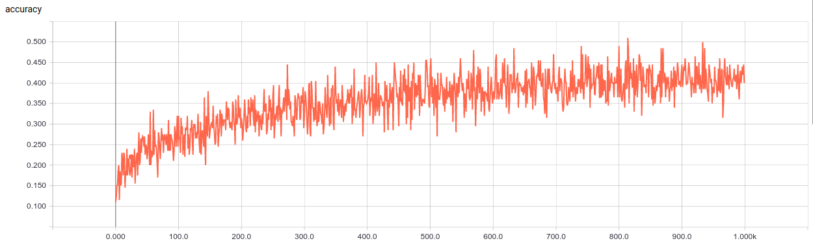
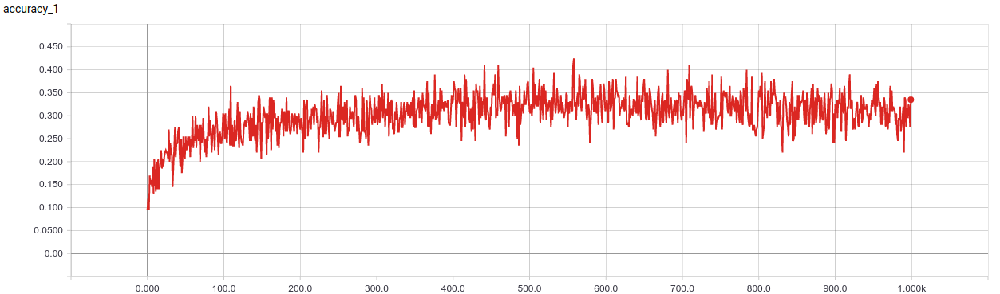
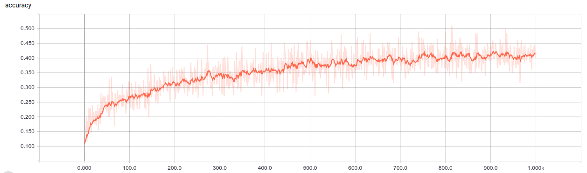
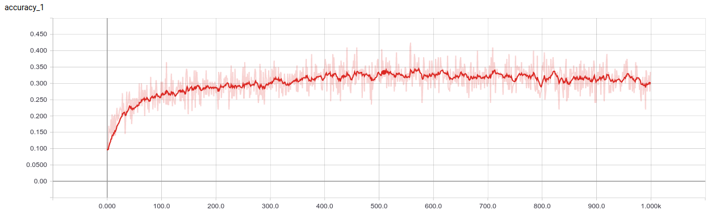
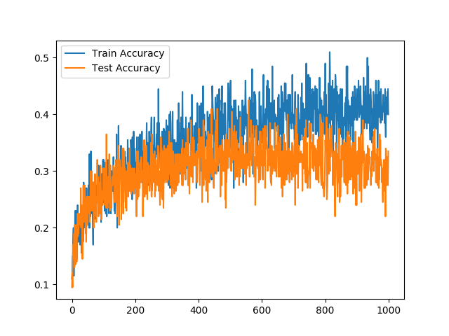

# CIFAR-10 Tensorflow Test
A test to improve my abilities on Tensorflow

## Actions
In this algorithm I had to:
  * Import CIFAR-10
  * Convert dataset to TfRecord
  * Read TFRecord file
  * Create batch
  * Create a model with 3 Conv Layer and 2 Fully Connected Layers
  * Optimizer is Adam with parametric Learning Rate with a decay 
  * Training for 1000 epochs
  * Results written inside Tensorboard for analysis
  
## Run the code

Open a Terminal and clone this repository.

Go inside the folder.

`$ cd <repository_folder>`

To run, please insert this code below:

`$ python3 main.py --train`

To see runtime visualization of how training is going, please type this in Terminal

`$ tensorboard -logdir=summary/`

## Results
In this section, there are illustrated results obtained after a training session. 

### Original graphs

### Smoothed graphs

### Comparison
The comparison between data has been produced using:
`$ python3 plot_comparison.py`
It needs a CSV file named `run_tcomparison-accuracy.csv` with 3 columns(`step`,`test`,`train`)
  

## Conclusion

Results are just as expected which means with an accuracy near 40% in training phase comapred to the ~10% obtained with random results. In a previous try, I had a 99% which was caused by missing augmentation of data inside the `shuffle_batch` related to the images and it was suffering of overfitting.
